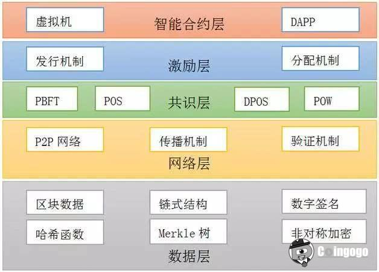
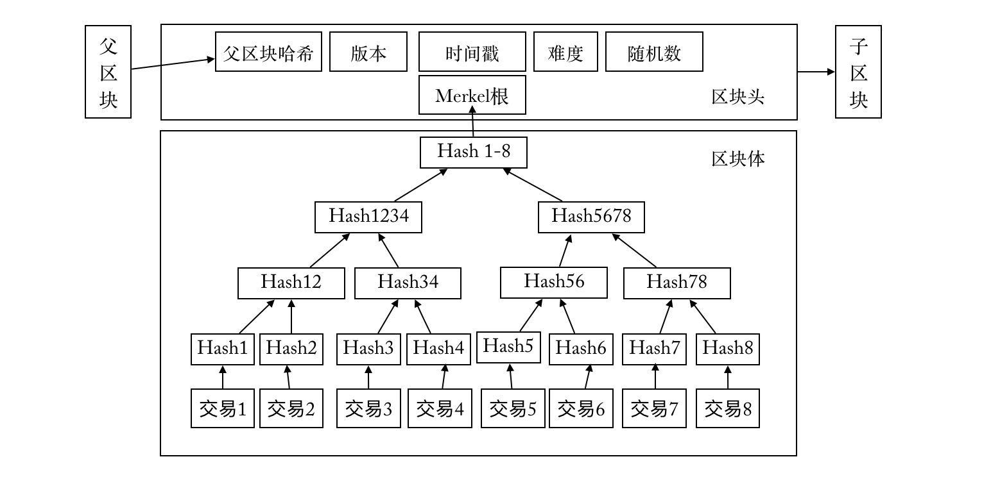
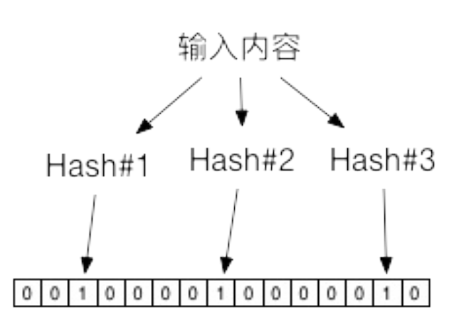
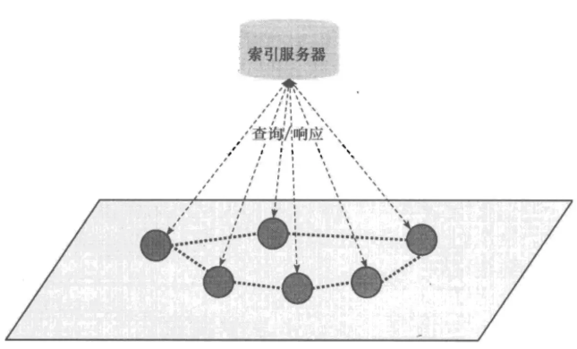
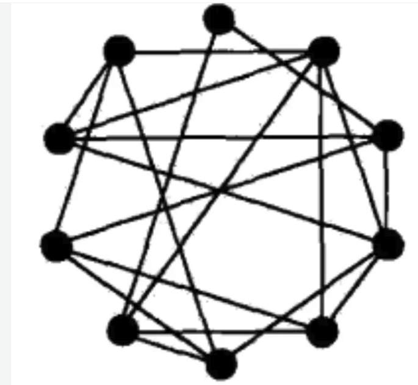
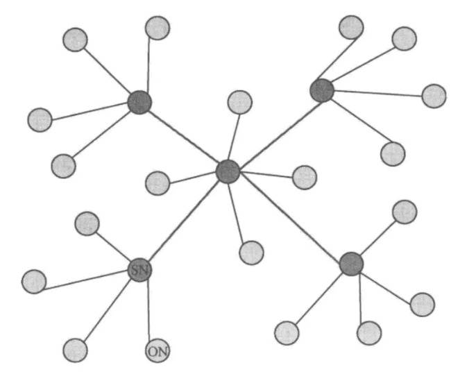
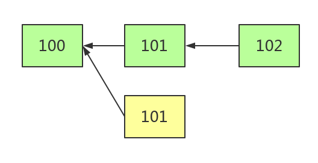

# 
区块链技术研究报告

  
软件支持组 赵堃圻

* ## 区块链的演化
  其实早在上世纪50年代，就有人开始研究利用加密技术来提高支付系统的效率。类似于e-cash、B-money等为后来比特币的出现奠定了基础。

  从比特币开始，算是区块链技术被第一次大规模的应用。 比特币出现后，区块链技术的价值也越来越受到关注。

  根据参与者的不同，区块链可以分为公有(Public)链、联盟(Consortium)链和私有(Private)链。
  
  比特币、以太坊是典型的共有链，任何人都可以参与使用和维护，信息完全公开。
  
  私有链,由集中管理者进行管理限制,只有内部少数人可以使用,信息不公开,一般认为跟传统中心化记账系统的差异不明显,公司使用私有链代替传统数据库，并没有体现出区块链去中心化的思想，一些人认为，没有代币的区块链，可以一种分布式多版本并发控制(MVCC)数据库的形式而存在。多版本并发控制，可防止两笔交易在数据库中修改一个单一列，而区块链，则是阻止两笔交易在区块链中的单个输出。
  
  联盟链则介于两者之间,由若干组织一起合作(如供应链机构或银行联盟等)维护一条区块链,该区块链的使用必须是带有权限的限制访问,相关信息会得到保护,典型如[__超级账本__][1]项目。在架构上,现有大部分区块链在实现都至少包括了网络层、共识层、智能合约和应用层等分层结构,联盟链实现往还会引入额外的权限管理机制。

  根据应用场景的不同，区块链技术从被比特币应用以来，发展至今，可以看做三次革命：
  |||
  |------|------|
  |区块链1.0|以比特币为代表的 __虚拟货币__ 时代，催生了大量的虚拟货币和货币交易平台，实现了去中心化交易|
  |区块链2.0|以以太坊智能合约为代表的 __可编程金融__ 时代，利用区块链技术在减少中间人的情况下实现了可信的金融交易活动，节省了交易中间的时间和人力成本|
  |区块链3.0|除货币、金融外，将区块链应用到各行业的不同场景，比如物联网|
* ## 区块链架构

  从架构上来说，区块链可以简单分为六个层次：应用层、合约层、激励层、共识层、网络层、数据层，六层自顶向下。
  
  下图是区块链2.0（智能合约 + 区块链）的架构图（这里没有包括应用层）。
  

  |层级|解释|
  |------|------|
  |应用层|封装了区块链的各种应用场景和案例，比如以太坊上的DApp|
  |合约层|封装了脚本、算法、智能合约，是区块链可编程性的基础|
  |激励层|负责激励的发行制度和分配制度，多出现在公链中，比如比特币的“挖矿”奖励机制|
  |共识层|主要负责共识算法和共识机制|
  |网络层|点对点（P2P）的组网机制，数据传播和验证机制等|
  |数据层|封装区块链的链式结构、区块结构和加密技术等|

  下面就来介绍一下每一层的具体作用和一些核心知识。

* ### 数据层

  数据层是区块链的底层模型，定义了区块的数据结构和整个区块链的链式结构（一个有序、反向链接的列表）。其中还包括一些密码技术：hash算法、非对称加密、数字签名、merkle树等。

  
  
  区块的结构和hash算法的知识，在另一篇文章里有介绍，这里就不再做赘述了。这里主要介绍一下merkle树（默克尔树又称哈希树），merkle树就是上图区块体里的二叉哈希树，其主要特点为：
  
  * 最下面的叶子节点包含存储数据或其hash值。

  * 非叶子节点(包括中间节点和根节点)都是它的两个孩子节点内容的哈希值。

  比如，以hash算法为double SHA256为例：
      
      Hash1 = SHA256(SHA256(交易1))
      Hash2 = SHA256(SHA256(交易2))
      Hash12 = SHA256(SHA256(Hash1 + Hash2))
      Merkel根 = 根节点

  利用这种数据结构，有以下几点好处:
  1. 只要对比根节点，就可以证明两组数据是否完全相同。
  
  2. 如果有一条数据改变，可以沿着树的路径快速定位，比如交易1变了，只要沿着root(即Hash1-8)->Hash1234->Hash12->Hash1最多通过O(lgn)	时间即可快速定位到实际发生改变的数据块。
  
  3. 零知识证明，如果我想要验证一条交易信息是否真实存在，只需要给出几个非叶子节点就行，也就是说不用暴露出其他的数据，比如想验证交易2的真实性，只需要给出Hash1，Hash34，Hash5678，root即可，验证者只需要根据交易2和给出的几个非叶子节点的值，就能求出根节点的值是否一致，以证明交易2是真实存在的。
  
  介绍merkle完树，需要介绍一下"简单支付验证"（SPV）。我们知道区块链可以看做是一份数据库，每个加入到区块链网络中的节点，都可以将整条链上的数据下载到本地。一般来说，要验证一份交易信息是否合法，只要下载全部的数据去查询它是否存在就行，不过，随着区块链高度的增加，区块链上的数据越来越大，一些设备(平板、手机等)已经没有办法存储这么大量的数据，对于这样的设备，通过简化的支付验证（SPV）的方式来验证。

  首先，“轻钱包”用户，下载区块链的所有区块头到本地，当需要验证一笔交易信息时，SPV要拿着这个交易的信息向网络发起查询请求，这个请求被称为merkle block message。当其他有完整区块链数据的客户端收到这个请求之后，利用传过来的交易信息在自己的区块链数据库中进行查询，并把验证路径(也就是merkle树需要验证一个叶子节点时的路径)返回给请求源，SPV拿到验证路径之后，再做一次merkle校验，确认无误之后，就认为这个交易是可信的。区块头只有80字节，每小时6个，一年也就4M大小，比100多G的区块链数据小得多。

  根据上面所说的，只保存区块头的“轻钱包”用户只要知道交易信息在哪个区块上以及知道验证路径就可以验证一笔交易是否合法，现在又有了新问题:
  1. SPV需要像其他节点发请求，怎么保证网络返回的信息不是伪造的。

  2. 一个完整节点怎么从区块链里面查一个交易？

  3. 怎么获取merkle验证路径？

  怎么保证网络信息不是伪造的：我们知道，不同字符串碰撞到同一个sha256的概率极小，那么double sha256的概率就是它的平方，而merkle root是经过一层一层计算上来的，如果一个区块只有一个（或2个）交易，那么就是double^(2+1) sha256，而如果是4个交易，就有double^(4 + 2 + 1) sha256，更何况一个区块有那么多交易，要经过merkle运算得到一个相同的hash，几乎是不可能的，因此，在merkle验证中用一个伪造的交易hash来得到一个已知来merkle root是不可能的。

  怎么从区块链里面查询一个交易：一种设计是，把每一个区块的数据结构修改为关系型数据库，通过关系型数据库，可以用sql语句快速查询。但是，要遍历查询所有区块链，是比较浪费的。还有一种想法是，利用交易的时间戳来快速定位区块位置，在临近的几个区块中快速找到它。
  

  怎么获取merkle验证路径：merkle的验证路径生成的前提是已经存在一棵完整的merkle树。市面上有很多merkle树的实现包，有的包直接给出getProof的方法来获取某个叶子节点的验证路径。
  
  这里还要引入一下在大数据处理领域经常用到的 __布隆过滤器__ 。
  

  布隆过滤器首先需要一个每位都是0的向量，对同一个给定输入来说,用多个Hash函数计算出多个地址,分别在位串的这些地址上标记为1。进行查找时,进行同样的计算过程,并查看对应元素,如果都为1,则说明较大概率是存在该输入。布隆过滤器相对单个Hash算法查找,大大提高了空间利用率,可以使用较少的空间来表示较大集合的存在关系。布隆过滤器在应用中误报率往往很低,例如,在使用7个不同	Hash函数的情况下,记录100万个数据,采用2MB大小的位串,整体的误判率将低于1%。而传统的Hash查找算法的误报率将接近10%。

  有了布隆过滤器，“轻钱包”节点在进行SPV时，就不用将自己的钱包地址信息全部告诉网络中的其他节点，只需要给出部分自己钱包的地址信息，全节点返回可能相关的 __UTXO__ (Unspent Transaction Outputs，未使用过的交易输出)，这种方法实际上就是采用布隆过滤器的方法隐藏用户隐私，从而做到即保护用户隐私，又节省存储空间和带宽。在前面的章节，我们知道布隆过滤器的两个特点：只能告诉你某个元素可能存在集合中以及某个元素一定不存在集合中。这里可以简单理解Bloom Filter就是一个过滤器，用来过滤不属于钱包的UTXO。

* ### 网络层
  区块链网络中的每个节点地位是对等的，网络中的每一台计算机既能充当网络服务的请求者，又对其它计算机的请求做出响应，提供资源、服务和内容。通常这些资源和服务包括：信息的共享和交换、计算资源（如CPU计算能力共享）、存储共享（如缓存和磁盘空间的使用）、网络共享、打印机共享等，这样的网络结构称为P2P(Peer-to-peer)网络。

  P2P 网络不同于传统的客户端/服务端(client/server,C/S)结构，P2P 网络中的每个节点都可以既是客户端也是服务端，因此也不适合使用 HTTP 协议进行节点之间的通信，一般都是直接使用 Socket 进行网络编程。P2P 主要存在四种不同的网络模型(这里所说的网络模型主要是指路由查询结构，即不同节点之间如何建立连接通道):集中式、纯分布式、混合式和结构化模型。

  1. 集中式(中心化拓扑)：
      
      有一个中心服务器负责记录共享信息(索引信息)并应答对这些信息的查询。与C/S模式的差异是在C/S结构中，客户端之间没有数据流，通过中心服务器交换数据。而P2P登录与信息查询都与中心服务器连接，但查询到数据后，就与存放数据的客户端直接建立连接。集中式路由的优点就是结构简单、实现容易。但缺点也很明显，由于中心节点需要存储所有节点的路由信息，当节点规模扩展时，就很容易出现性能瓶颈；而且也存在单点故障问题。

      
  
  2. 纯分布式(全分布式非结构化拓扑)：
      
      移除了中心节点，在 P2P 节点之间建立随机网络，就是在一个新加入节点和 P2P 网络中的某个节点间随机建立连接通道，从而形成一个随机拓扑结构。新节点加入该网络的实现方法也有很多种，最简单的就是随机选择一个已经存在的节点并建立邻居关系。新节点与邻居节点建立连接后，还需要进行全网广播，让整个网络知道该节点的存在。全网广播的方式就是，该节点首先向邻居节点广播，邻居节点收到广播消息后，再继续向自己的邻居节点广播，以此类推，从而广播到整个网络。这种广播方法也称为泛洪机制。纯分布式结构不存在集中式结构的单点性能瓶颈问题和单点故障问题，具有较好的可扩展性，但泛洪机制引入了新的问题，主要是可控性差的问题，包括两个较大的问题，一是容易形成泛洪循环，比如节点A发出的消息经过节点B到节点C，节点C再广播到节点A，这就形成了一个循环；另一个棘手问题则是响应消息风暴问题，如果节点 A 想请求的资源被很多节点所拥有，那么在很短时间内，会出现大量节点同时向节点A发送响应消息，这就可能会让节点A瞬间瘫痪。

    

  3. 混合式(半分布式拓扑):

      混合式其实就是混合了集中式和分布式结构，网络中存在多个超级节点组成分布式网络，而每个超级节点则有多个普通节点与它组成局部的集中式网络。一个新的普通节点加入，则先选择一个超级节点进行通信，该超级节点再推送其他超级节点列表给新加入节点，加入节点再根据列表中的超级节点状态决定选择哪个具体的超级节点作为父节点。这种结构的泛洪广播就只是发生在超级节点之间，就可以避免大规模泛洪存在的问题。

      

  4. 结构化模型(全分布式结构化拓扑):
      
      结构化模型也是一种分布式网络结构，但与纯分布式结构不同。纯分布式网络就是一个随机网络，而结构化网络则将所有节点按照某种结构进行有序组织，比如形成一个环状网络或树状网络。而结构化网络的具体实现上，普遍都是基于 __DHT__(Distributed Hash Table，分布式哈希表) 算法思想。DHT 只是提出一种网络模型，并不涉及具体实现，主要想解决如何在分布式环境下快速而又准确地路由、定位数据的问题。具体的实现方案有 Chord、Pastry、CAN、Kademlia 等算法，其中 Kademlia 也是以太坊网络的实现算法。

      在 P2P 网络中，可以抽象出两种空间：__资源空间__ 和 __节点空间__。资源空间就是所有节点保存的资源集合，节点空间就是所有节点的集合。对所有资源和节点分别进行编号，如把资源名称或内容用Hash函数变成一个数值（这也是 DHT 常用的一种方法），这样，每个资源就有对应的一个ID，每个节点也有一个ID，资源ID和节点ID之间建立起一种映射关系，比如，将资源n的所有索引信息存放到节点n 上，那要搜索资源n时，只要找到节点n即可，从而就可以避免泛洪广播，能更快速而又准确地路由和定位数据。当然，在实际应用中，资源ID和节点ID之间是无法做到一一对应的，但因为ID都是数字，就存在大小关系或偏序关系等，基于这些关系就能建立两者的映射关系。这就是DHT的核心思想。DHT算法在资源编号和节点编号上就是使用了分布式哈希表，使得资源空间和节点空间的编号有唯一性、均匀分布式等较好的性质，能够适合结构化分布式网络的要求。

* ### 共识层
  
  区块链从本质上而言是一种分布式账本技术。传统的账本，通常会以数据库的形式，集中存储在银行或公司的服务器节点上。而在区块链的网络中，每个节点都会保有一份完整的账本，且所有节点的账本内容完全一致。每个节点都可以根据自己本地的账本去查找交易，也可以往账本中添加交易。
  
  这样就带来了一个问题，如果所有节点同时一起写入账本数据，那么肯定数据会不一致。因此需要一种机制来保证区块链中的每一区块只能由一个节点来负责写入，并且让所有其他节点一致认同这次写入。如何选出写入账本数据的节点，这就是共识机制。

  [__拜占庭将军问题__][2] 是用来解释异步系统中共识问题的一个虚构模型。

  为了便于理解比特币中对于拜占庭问题的解法（PoW、PoS等），先看一下著名的CAP原理。该原理被认为是分布式系统领域的重要原理之一,深刻影响了分布式计算与系统设计的发展。

  CAP	原理:分布式系统无法同时确保一致性(Consistency)、可用性(Availability)和分区容忍性(Partition),设计中往往需要弱化对某个特性的需求。
  
  > * 一致性(Consistency):任何事务应该都是原子的,所有副本上的状态都是事务成功提交后的结果,并保持强一致;

  > * 可用性(Availability):系统(非失败节点)能在有限时间内完成对操作请求的应答;

  > * 分区容忍性(Partition):系统中的网络可能发生分区故障(成为多个子网,甚至出现节点上线和下线),即节点之间的通信无法保障。而网络故障不应该影响到系统正常服务。

  CAP	原理认为,分布式系统最多只能保证三项特性中的两项特性。必须根据实际需求从三个特性中选择一个弱化。

  > * 弱化一致性: 对结果一致性不敏感的应用,可以允许在新版本上线后过一段时间才最终更新成功,期间不保证一致性。
  >
  >   例如网站静态页面内容、实时性较弱的查询类数据库等,简单分布式同步协议如Gossip,以及CouchDB、Cassandra数据库等,都为此设计。
  >
  > * 弱化可用性: 对结果一致性很敏感的应用,例如银行取款机,当系统故障时候会拒绝服务。MongoDB、Redis、MapReduce等为此设计。
  >  
  >   Paxos、Raft等共识算法,主要处理这种情况。在Paxos类算法中,可能存在着无法提供可用结果的情形,同时允许少数节点离线
  >
  > * 弱化分区容忍性：现实中,网络分区出现概率较小,但很难完全避免。两阶段的提交算法,某些关系型数据库主要考虑了这种设计。
  >  
  >   实践中,网络可以通过双通道等机制增强可靠性,实现高稳定的网络通信。
  
  下面介绍几种区块链中常用的共识机制:

  1. 工作量证明，POW(Proof Of Work)：
     
     通过计算来猜测一个数值(nonce),使得拼凑上交易数据后内容的Hash值满足规定的上限。由于Hash难题在目前计算模型下需要大量的计算,这就保证在一段时间内,系统中只能出现少数合法提案。反过来,能够提出合法提案,也证明提案者确实已经付出了一定的工作量。
     
     同时,这些少量的合法提案会在网络中进行广播,收到的用户进行验证后,会基于用户认为的最长链基础上继续难题的计算。因此,系统中可能出现链的分叉(Fork),但最终会有一条链成为最长的链。

     但是POW实在是太浪费资源了，一直暴力求解nonce，不知道用了多少电和GPU。
     
  2. 权益证明，POS(Proof Of Stake)：

     类似现实生活中的股东机制,拥有股份越多的人越容易获取记账权(同时越倾向于维护网络的正常工作)。典型的过程是通过保证金(代币、资产、名声等具备价值属性的物品即可)来对赌一个合法的块成为新的区块,收益为抵押资本的利息和交易服务费。提供证明的保证金(例如通过转账货币记录)越多,则获得记账权的概率就越大。合法记账者可以获得收益。
     
     PoS试图解决在PoW中大量资源被浪费的缺点,受到了广泛关注。恶意参与者将存在保证金被罚没的风险,即损失经济利益。

     一般的,对于PoS来说,需要掌握超过全网1/3的资源,才有可能左右最终的结果。这个也很容易理解,三个人投票,前两人分别支持一方,这时候,第三方的投票将决定最终结果。
    
     PoS机制虽然考虑了PoW的不足，但也有缺点：依据权益结余来选择，会导致首富账户的权力更大，有可能支配记账权。

  3. 股份授权证明机制，DPoS(Delegated Proof of Stake):
     
     以上的PoW和PoS的挖矿过程，是全网所有节点共同参与的，每一时刻都有成千上万个节点同时去争取产出下一个block，因此会时有发生区块链分叉（fork）的问题。即同一时刻，两个节点同时产出了next block，但由于网络时延的问题，block产出的时候两个节点并不知道有其他节点已经产出了另一个block，因此这两个block都被发布到了网络中。

     正是由于分叉的存在，block的产出时间间隔不能太短。各区块链通过动态调整的挖矿难度，将block时间间隔稳定在自己期望的水平。例如最初比特币的间隔是10分钟，后续的以太坊是15秒左右。如果时间间隔进一步调短（即降低挖矿难度），分叉问题就会大量显现，不利于共识的达成和系统的稳定。

     为了缩短block产出时间，delegated开头命名的系列方法被提了出来。其基本思想就是，选出少量的代表来负责生产block。这样即使缩短block的时间间隔，也不会有严重的分叉发生。每一个持有比特股的人都可以投票选举代表。得到总同意票数中的前N个（N通常定义为101）候选者可以当选为代表，当选代表的个数需满足：至少一半的参与投票者相信N已经充分地去中心化。代表的候选名单每个维护周期（1天）更新一次。代表然后随机排列，每个代表按序有2秒的权限时间生成区块，若代表在给定的时间片不能生成区块，区块生成权限交给下一时间片对应的代表。如果代表提供的算力不稳定或计算机宕机等，持股人可以随时通过投票更换这些代表。
  
* ### 激励层

  激励层将经济因素集成到区块链技术体系中来，包括经济激励的发行机制和分配机制等，主要出现在公有链当中。

  区块链共识过程通过汇聚大规模共识节点的算力资源来实现共享区块链账本的数据验证和记账工作, 因而其本质上是一种共识节点间的任务众包(众包指的是一个公司或机构把过去由员工执行的工作任务，以自由自愿的形式外包给非特定的大众志愿者的做法。)过程。去中心化系统中的共识节点本身是自利的, 最大化自身收益是其参与数据验证和记账的根本目标。

  因此, 必须设计激励相容的合理众包机制, 使得共识节点最大化自身收益的个体理性行为与保障去中心化区块链系统的安全和有效性的整体目标相吻合。

  以比特币为例：

  激励层是新发行比特币奖励（挖矿）和交易流通过程中的手续费。

  其中比特币的发行机制是随着时间阶梯性递减(每隔4年，挖出一个"矿"的奖励减少一半)。

  分配机制，目前比特币的分配机制有数十种，小算力节点通过加入“矿池”来提高挖到新区块的概率，并共享手续费，如何分配就是它的分配机制。
  
  不同于比特币，以太坊为了更快的产生新块(比特币为10分钟出一块，以太坊大概10秒钟出一块)，采用了不同的激励机制:

  矿工在获得记账权后可以获得5个以太币的奖励。
  
  除了上面的静态奖励，我们还有动态奖励。首先记账的区块中所有的交易费用归矿工所有，除此之外，矿工还可以从每个叔区块中获得额外的1/32以太币的奖励。

  在这里，__叔区块__ 是指那些没有在最长的那条链上，而是分叉链上挖出的有效区块。由于各个节点是各自独立的工作，就有可能出现两个独立的矿工先后发现了两个不同的满足要求的区块，被称为临时分叉。以太坊采用这种机制而分散中心挖矿的现象（即最大矿池垄断区块生产，导致单个矿工总是落后矿池的区块信息的情况）。采用这种机制，即使单个分散节点没有大矿池挖矿速度快，那他们也会有相应的奖励。

  

  如上图说是，当打包102的时候，发现还有个黄色的101也指向自己（102）的爷爷(100)，那么黄色的101就是一个叔块（当然这个是最高级别的叔块，如果打包102的时候还没有黄色的101，打包103的时候才发现黄色的101，那么黄色的101也是会当做区块打包到103内，区别是黄色101区块的生产者获得奖励不同）

  因为以太坊引入了智能合约的概念，如果有用户恶意调用智能合约，或在智能合约中出现无限循环运行的情况，就会造成网络就需要承担巨大的流量，所以为了避免这种情况发生，就引入了gas(燃料)机制，用户每次调用、部署都需要支付gas，如果gas用完了或者给程序设置一个使用gas的上限，即使是死循环，程序也会停止。

* ### 合约层

  智能合约是一个在计算机系统上，当一定条件被满足的情况下，可以被自动执行的合约。其实在区块链之前，这种数字化合约就被一些拥有公众信任的机构使用过，比如银行设置的信用卡还款，当到了还款日，如果储蓄卡上的余额足够还款，银行的计算机系统就会自动扣款来支付信用卡账单，这样可以减少很多中间环节的资源。之所以智能合约没有被普及，是因为现实生活中像银行这样拥有强大信用保证的机构毕竟是少数，对于一些小的机构，用户很难相信部署在计算机系统上的合约不会被篡改或被黑客入侵。区块链的出现，解决了智能合约中的信任问题。

  现在越来越多的像以太坊这样的区块链社区都提供了公开的智能合约编程接口，开发者可以自己编写智能合约在链上部署运行。

  

Distributed	Ledger

[1]:https://www.hyperledger.org/

[2]:https://juejin.im/post/5ac1e9adf265da23906c2dc8#comment

* ##相关网站

1.IBM区块链技术社区： https://developer.ibm.com/cn/blockchain/
